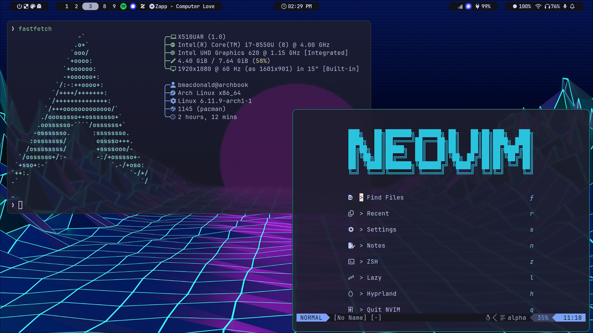
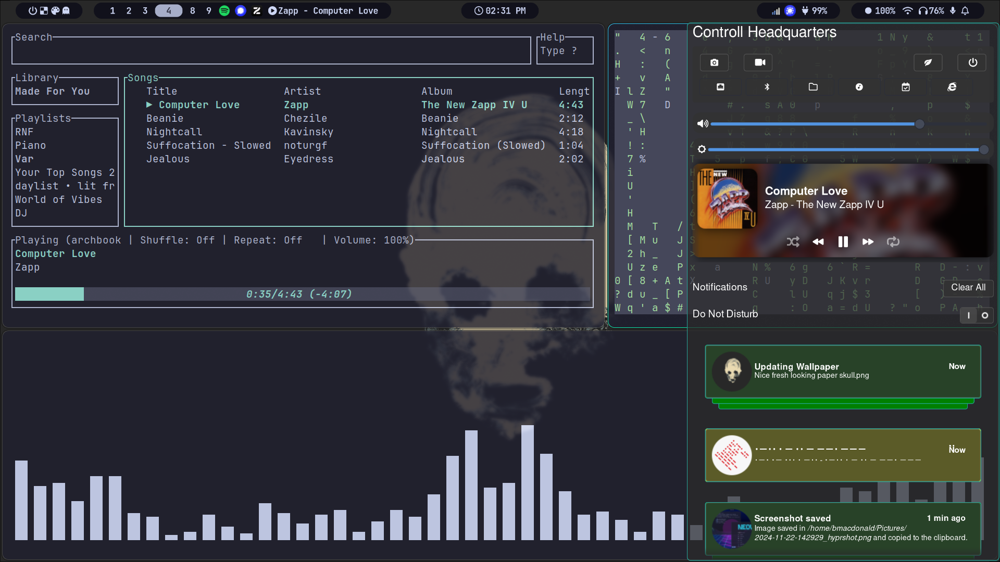

# Dotfiles

Brady MacDonald: Dotfiles worth saving
Archlinux is assumed

- [Install](#Install)
- [Packages](#Packages)
- [Use](#Use)
- [Neovim](#Neovim)

## Screenshots




## Install

Clone the repo onto your machine and run `./install.sh`

```bash
    git clone https://github.com/Brady-MacDonald/dotfiles.git
    cd dotfiles
    ./install.sh
```

You will be prompted to install the following packages

## Packages

### Required

These packages are directly referenced in dotfiles and will error if not installed

#### Hyprland

Hyprland is the wayland compositor used and dotfiles are built around it
- hyprland hyprpaper hyprlock hypridle


- waybar
- swaync
- alacritty
- yazi
- zen-browser

- wpctl pactl
- bluez bluez-utils
- playerctl
- clip
- nm-applet 
- qt6-wayland qt5-wayland

### Optional

Packages which you will probably end up installing anyway at some point

- jq

#### AUR

`spotify-tui`

Packages installed from the AUR should use yay

- vlc-git
- signal
- spotify

| Package       | Purpose       |
| ------------- | ------------- |
| hyprland      | Title         |
| yazi          | Text          |

## Use

`./scripts/`
Added to `$PATH`, offer various utilities

## Neovim

Check out the nvim-config repo got the Neovim setup: [nvim-config](https://github.com/Brady-MacDonald/nvim-config.git)

No, I do not want to add it as a submodule...
