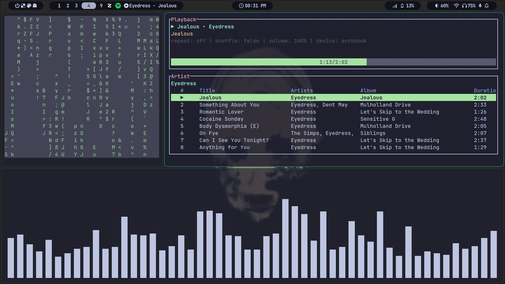
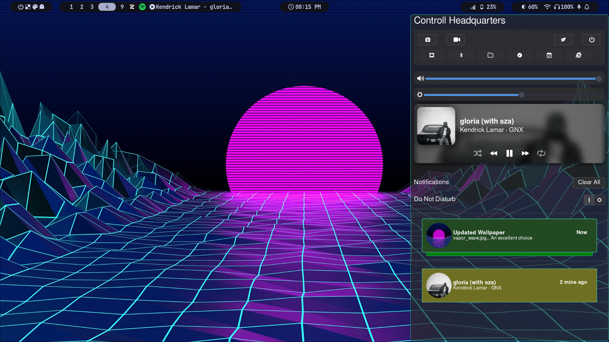
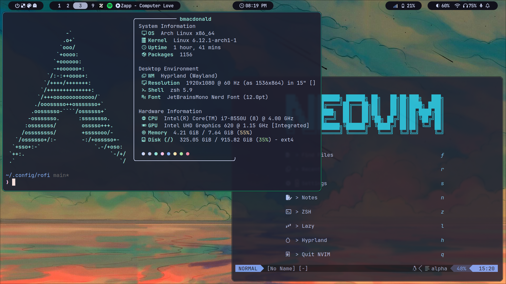

# Arch Linux Dotfiles

- [Install](#Install)
- [Packages](#Packages)
    - [Required](#Required)
    - [Optional](#Optional)
    - [AUR](#AUR)
- [Use](#Use)
- [Neovim](#Neovim)





## Install

Clone the repo onto your machine and run `./install.sh`

```bash
git clone https://github.com/Brady-MacDonald/dotfiles.git
cd dotfiles
./install.sh
```

You will be prompted to install the following packages

## Packages
### Required

These packages are directly referenced in dotfiles and will error if not installed

| Package       | Purpose                |
| ------------- | ------------- |
| hyprland | Wayland compositor |
| ly | Display Manager |
| ghostty | Terminal |
| tmux | Terminal multiplessor |
| zsh | Shell |
| waybar | Status bar |
| nautilus | File explorer|
| yazi | Terminal files |
| swaync | Notification Center |
| zen-browser | Browser |


#### Hyprland
---
Hyprland is the wayland compositor used
Dotfiles are built around it and its ecosystem
```bash
sudo pacman -Syu hyprland hyprpaper hyprlock hypridle hyprsunset hyprshot
```

#### Display Manager
Ly is used as the DM
Minimal TUI login screen
```bash
sudo pacman -S ly
systemctl enable ly.service
``` 

#### Terminal
Ghostty and zsh for terminal stuff
```bash
sudo pacman -S ghostty tmux zsh
``` 

#### Bluetooth
```bash
sudo pacman -S bluez bluez-utils blueman`
```

- Provides the `bluetoothctl` executable
- Must enable the systemd service `bluetooth.service`
- `blueman` to provide a GUI

```bash
sudo pacman -S playerctl brightnessctl
```

#### Networking
```bash
sudo pacman -S networkmanager network-manager-applet
```

#### Audio
Pipewire is used as the audio server
```bash
sudo pacman -S pipewire pipewire-pulse pipewire-jack wireplumber
systemctl --user --now enable pipewire pipewire-pulse wireplumber
```

Enable the systemd services
wireplumber: Session manager (`wpctl`)

#### Themes
- qt6-wayland qt5-wayland
- GTK

#### Application Launcher
Rofi is used as the dmenu replacement
```bash
sudo rofi-wayland`
```

### Optional
Packages which you will probably end up installing anyway at some point

| Package       | Purpose                |
| ------------- | ------------- |
| Spotify | Muse |
| Lazygit / Lazygit | TUI |
| wl-clipboard | Wayland clippy |
| transmission-gtk | Torrent client |


```bash
sudo pacman -S wl-clipboard
```
Exposes the `wl-copy` and `wl-paste` commands

```bash
sudo pacman -S lazygit lazydocker
```

### AUR
Packages installed from the AUR 
Installing from AUR should be done using [yay](https://github.com/Jguer/yay)

- vlc-git
- signal-desktop
- spotify

## Use

`./scripts/`
Added to `$PATH`, offer various utilities

## Neovim

Check out the [nvim-config](https://github.com/Brady-MacDonald/nvim-config.git) repo... got a nice Neovim setup
No, I do not want to add it as a submodule.
